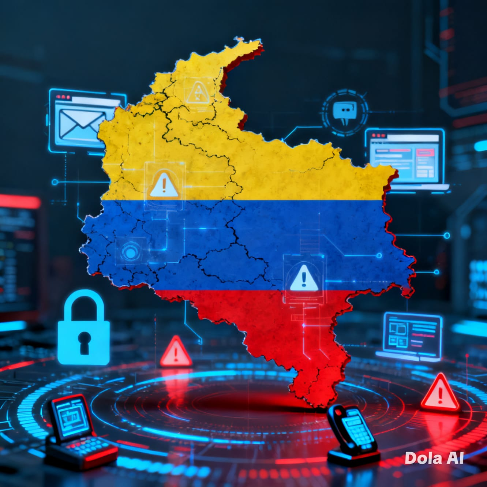

# 🔐 Conectados Pero Vulnerables

  

---

## 📌 Descripción

Este proyecto tiene como propósito generar conciencia y evidenciar que, hoy en día, tanto las personas como las empresas están expuestas constantemente a ciberdelitos como el **phishing**, **smishing**, **vishing** y el **robo de identidad**, los cuales se han convertido en las formas de fraude más comunes en Colombia.

---

## ⚠️ Problemática

El crecimiento del uso de tecnologías digitales ha traído consigo un aumento significativo en los delitos informáticos. Muchas personas desconocen cómo operan estos ataques, lo que las convierte en blancos fáciles para los ciberdelincuentes.

---

## 🎯 Objetivo

Fortalecer el conocimiento en ciberseguridad y promover buenas prácticas que permitan prevenir fraudes digitales.

---

## 🧠 Tipos de ciberdelitos más comunes

- 🎣 **Phishing**: correos o páginas falsas para robar información  
- 📱 **Smishing**: mensajes SMS o WhatsApp fraudulentos  
- 📞 **Vishing**: llamadas telefónicas engañosas  
- 🆔 **Suplantación de identidad**  

---

## 🛡️ Recomendaciones básicas

- No compartir información personal o bancaria  
- Verificar enlaces antes de hacer clic  
- No confiar en mensajes urgentes o sospechosos  
- Activar autenticación en dos factores (2FA)  

---

## 📖 Referencia

Artículo: *"Los crímenes cibernéticos más comunes en Colombia y cómo evitarlos"*  
Fuente: Forbes Colombia  
🔗 https://forbes.co/tecnologia/los-crimenes-ciberneticos-mas-comunes-en-colombia-y-como-evitarlos

---

## 👨‍💻 Autor

Proyecto desarrollado por **Cristian Cárdenas**  
